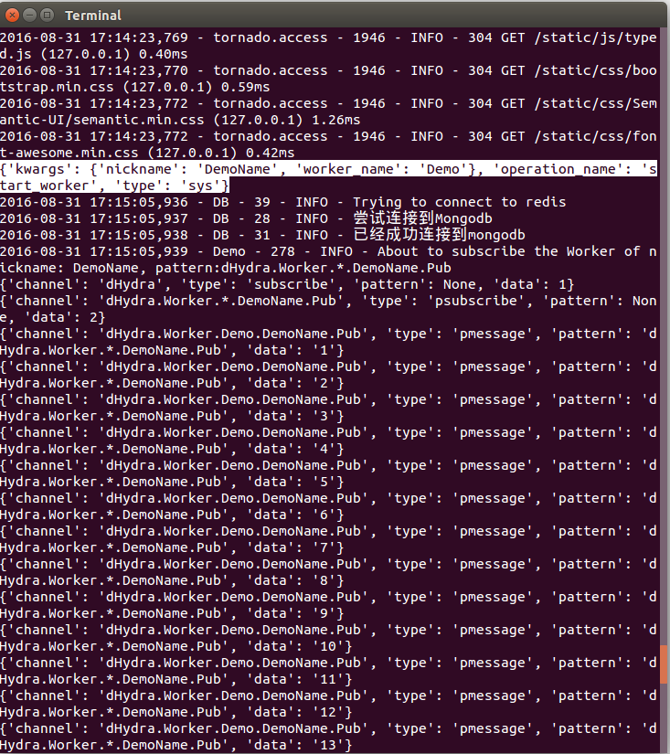
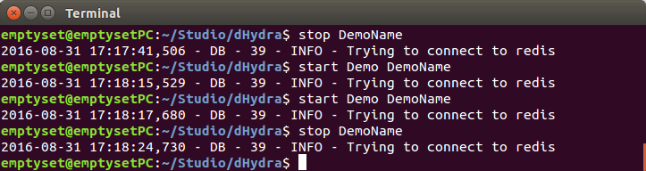
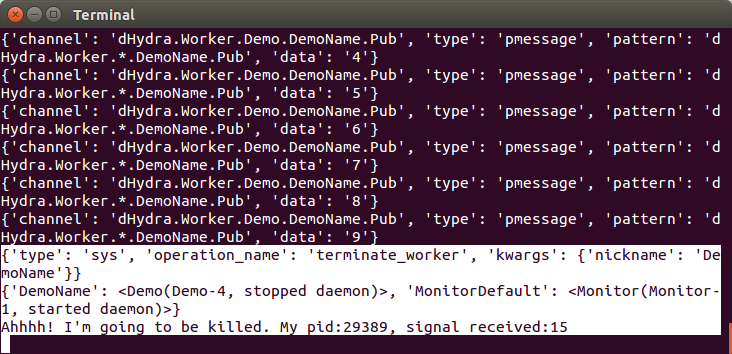

# dHydra简介

## 由于新版本刚有所改动，原先的模块部分还在改写中，文档也在补充中


> dHydra是一个主要用于量化投资的二次开发框架（用以进行多进程多数据源的实时计算）
> 特点：
> （**Important: dHydra的目的不是生产数据，而是制作一个二次开发框架与架构，面向的对象主要还是以开发者为主，不对网络获取的数据源拥有最终解释权**）
> - 采用Redis作为消息队列分发
> - 每个Worker都可以被独立开启
> - 集成Tornado Web server给每个Worker分配了动态的url映射，让开发者可以自己定制可视化数据界面

> 自带数据获取的Vendor类有：
> - 获取雪球等数据
> - 获取新浪Level-2数据（新浪普及版与标准版通用。包含10档盘口与逐笔数据等Level2，详细介绍可以参考上交所的Level2数据使用说明书与新浪网页版Level2）
> - 对新浪Level2行情提供的数据提供现成的存储方案
> - 获取3秒/条实时获取数据并持久化存储
> - CTP期货行情与下单
> - 调用easytrader进行股票的下单

> TODO：
> - 数据可视化（TODO）
> - 基于Level-2高频数据的回测系统
> - ***IMPORTANT: 由于本宝宝精力有限，dHydra只支持python3.4以上的版本***

**github页面**：https://github.com/Emptyset110/dHydra

**二次开发文档：**http://doc.dhydra.org

**问答社区：**http://www.dhydra.org

**dHydra数据QQ群：458920407**


# 使用对象
- 正在学习使用python进行数据分析/数据挖掘的同学
- 对金融市场进行大数据分析的企业和个人
- 量化投资分析师（Quant）
---

# 运行环境
 - python 3.4以上 (开发环境Ubuntu 15.10, python 3.5)，**不对python2.7提供支持，多版本虚拟环境安装请参考安装dHydra文档**
 - mongodb 3.2
 - Redis

---

# Quick Start
## Step 1:安装Redis（略）
## Step 2:安装mongodb（略）
## Step 3:git clone或者直接下载代码解压
```
git clone https://github.com/Emptyset110/dHydra.git
# (此后把clone下来的最新部分复制到别处，把git仓库与自己的工作环境分开)
cd dHydra
pip install --editable .
```
等待pip安装完毕后（此时确保Redis与Mongodb服务都已经启动），在命令行输入
```
hail dHydra
```
然后你大致会看到如下信息，说明dHydra已经启动
```
2016-08-30 14:24:34,166 - DB - 39 - INFO - Trying to connect to redis
Welcome to dHydra!
    "hail dHydra"
         |
         |
    ┌────┴─────┐         ┌────────────┐
    |  dHydra  |         |   Tornado  |
    |  Server  ├─────────┤ Web Server ├──http://127.0.0.1:5000────┐
    └────┬─────┘         └──────┬─────┘                           |
         |                      |               默认两种url映射规则，例如：
    ┌────┴────┐                 |               /api/Worker/BackTest/method/
    |  Redis  ├─────────────────┘               /Worker/BackTest/index
    └──┬──────┘                                          详情参考文档
       |                                                          |
       ├─────Publish────┬─────Subscribe──────┬─────Publish───┐────┤
       |                |                    |               |
┌──────┴──┐        ┌────┴─────┐         ┌────┴─────┐    ┌────┴─────┐
| (Worker)|        | (Worker) |         | (Worker) |    | (Worker) |
| CTP     |        | Strategy |         | BackTest |    | Sina L2  |
└─────────┘        └──────────┘         └──────────┘    └──────────┘
2016-08-30 14:24:34,304 - DB - 39 - INFO - Trying to connect to redis
2016-08-30 14:24:34,311 - DB - 28 - INFO - 尝试连接到Mongodb
2016-08-30 14:24:34,658 - DB - 31 - INFO - 已经成功连接到mongodb
Monitor has started
Tornado webserver has started
2016-08-30 14:24:34,709 - DB - 39 - INFO - Trying to connect to redis
Listening on port: 127.0.0.1:5000
```

这样dHydra Server就启动了，它默认会开启一个叫Monitor的Worker用来监视其他Worker进程。目前Monitor还没有全部完成。
我们先可以尝试一下开启Demo，来看看在这个架构中，代码如何运行，我们又该怎么去写自己的代码。

**开启一个Worker的方式有许多种，例如最简单的是用命令行方式去开启**
### 用命令行启动/结束Worker
```
start Demo DemoName
```

> 这样做就会开启一个叫DemoName的Demo进程（我们待会儿再分析Demo.py的具体内容，目前我们会看到它做了如下三件事情
  >  - 自己订阅了自己的频道
  >  - 每秒向Redis中的"dHydra.Worker.Demo.DemoName.Pub"频道发送一个数字
  >  - 将自己订阅收到的内容打印到屏幕

> 原理：之所以可以这样做是因为刚才你运行了`pip install --editable .`，它在你当前环境下认识了start命令，它会调用dHydra.console下的start方法，这个方法向Redis中的"dHydra.Command"频道发送了一条指令，dHydra Server监听到此指令以后就会实例化Demo，并且起名叫DemoName

#### 用命令行关闭进程
```
stop DemoName
```

这里的`DemoName`是nickname，nickname是全局唯一的，可能有多个不同的进程都是Demo类，但是每个进程都有唯一的昵称

> 运行stop DemoName后，我们会向"dHydra.Command"频道发送一条指令，由dHydra Server去执行这个关闭Demo的任务，会捕捉到终止信号，并且执行用户自定义的`__before_termination__`

#### 对待重复开启的进程怎么处理？
> 有时候我们会有一些人为或者代码中的错误操作，比如不小心将同一个Worker开启了两次。不过不用担心，因为每个Worker都有自己的心跳线程，如果不额外设置，它会每3秒向Redis发送一次心跳，如果一个Worker在开启前发现有相同Nickname的Worker也在发送心跳，它将不会开启并且提出警告。

#### 在命令行中让dHydra Server开启/关闭进程
```python
from dHydra.console import *

# 实例化并开启一个worker
start_worker(worker_name = "SinaL2", nickname = "SinaL2Test", symbols = ["sz000001"])
# 如果是简单的命令行模式是没有办法向worker传kwargs参数的，但是通过这个方式来调用就可以了
# 例如刚才我们在生成SinaL2的时候传入了symbols参数。

# 结束一个Worker
stop_worker(nickname = "SinaL2Test")
```

#### 在非dHydra中实例化Worker并启动（这种方式不通过dHydra Server开启，而是直接在其他Python程序中实例化某个类）
```python
from dHydra.core.Functions import *

sina_l2 = get_worker_class(worker_name = "SinaL2", nickname = "SinaL2Demo", symbols = ["sz000001"])
sina_l2.start();sina_l2.join()
```

#### 在网页界面Monitor中开启/关闭进程
> ...还在制作中

## 二次开发
### 分析Demo.py来看看我们该怎样去订阅其他Worker生产的数据
首先需要引入父类`from dHydra.core.Worker import Worker`
可以在初始化的时候就确定订阅谁，也可以在之后订阅，在demo的例子中，它订阅了自己
```python
self.subscribe( nickname = self.__nickname__ )
```
如果要订阅其他Worker可以以此类推，例如
```python
self.subscribe( worker_name = "SinaL2" )
# 这样就会订阅所有SinaL2类生产的数据

self.subscribe( nickname = "SinaL2Demo" )
# 这样会订阅所有昵称为SinaL2Demo生产的数据
```
同样，用`unsubscribe`方法可以退订Worker

### 重写__data_handler__方法来处理数据
```python
    def __data_handler__(self, msg):
        print(msg)
```
由于数据是从redis取出的，所以没有做任何加工，是一个dict类型，包括订阅和退订信息也会收到。不熟悉redis的同学可以通过print它来查看格式。

> WHAT!!! 只需要一行代码？就能自动取数据了？萌主你是不是在逗我？
>
> 没错是这么简单的>.<不然你还想怎样？


### 重写__producer__方法来进行数据生产
在这个例子中，producer每秒生产1个数据，并且publish到redis自己的频道里
```
    def __producer__(self):
        import time
        i = 0
        while True:
            self.publish( i )
            i += 1
            time.sleep(1)
```

```python
# -*- coding: utf-8 -*-
from dHydra.core.Worker import Worker

class Demo(Worker):
    def __init__(self, **kwargs):
        super().__init__(**kwargs)  # You ae not supposed to change THIS

        self.subscribe( nickname = self.__nickname__ )

    def __data_handler__(self, msg):
        """
        As a Consumer, This Worker(Demo) receives(listens) messages, uses __data_handler__
        to deal with these msg

        The self.__listener__ is running in a daemon thread
        You can override this method to deal with the msg
        """
        print(msg)

    def __producer__(self):
        """
        As a Producer, This Worker ( Demo ) publishes one number per second to
        the redis channel of: "dHydra.Worker.Demo.DemoDefault.Pub"

        The name of the channel, by convention, is formatted as follows:
        "dHydra.Worker.<worker_name>.<nickname>.Pub"
        where <worker_name> is the name of the class -- "Demo" in this case,
        <nickname> is the customized (unique) name, which can be configured when
        the worker is initialized.

        "self.publish" is the method for publishing data to the channel.
        """
        import time
        i = 0
        while True:
            self.publish( i )
            i += 1
            time.sleep(1)

    def __before_termination__(self, sig):
        """
        It will be called when a TERM signal is received, right before sys.exit(0)
        """
        print("Ahhhh! I'm going to be killed. My pid:{}, signal received:{}".format(self.pid, sig ) )

```

---
# Question & Answer

### Q:请问新浪L2的数据能不能弄成调用api获取，而不是推送模式？[2016-08]
> 这个问题其实许多人都有问过。首先数据源用什么方式来发送数据，我们肯定就要用对应的方式去获取，至于取到数据以后想如何处理那其实是开发者的事情。比如可以直接插入Redis或者Mongodb做持久化，或者直接向一个全局变量dict中存储最新的行情，然后在策略需要行情的时候从这个dict中来获取。
> dHydra是个面向开发者的二次开发框架，其目的并不是做一个让所有人都满意的数据产品，而是一个可以让开发者不用过多纠结如何“造轮子”的二次开发框架。例如在新的版本里，我将Redis作为了消息队列分发者，去除了原先生产者和消费者的概念，把它们都合并到了Worker中，每个Worker作为进程可以随时被开启和关闭。这样不仅仅是python开发者，其他语言的使用者也可以直接通过订阅Redis来获取到dHydra的Worker生产的数据。
> 当然，dHydra本身就是个python框架，新版本做了一些url映射，这样每个Worker可以拥有自己的web ui界面了，Worker的开发是插件式的，希望Python开发者们能够喜欢，也希望更多开发者们能加入进来。

### Q：为什么你这个代码写得乱成一陀屎啊，看着好烦啊？[2016-03-22]
> 我本来以为随便封装一两个API，写个mongodb存储过程就可以了。所以也没有用什么设计模式，类的设计和框架结构也没有做好。
>
> 目前正在想办法改进一下架构，让数据更加模块化，同时把生产者（数据产生）和消费者（策略使用）分离开来。
>
> **[2016.04.10 更新]**
>
> 终于更新了版本，分离了数据获取和数据处理的模块，现在dHydra是一个二次开发框架了。**详情请参考二次开发文档：http://doc.dhydra.org**

### Q：为什么已经有类似tushare这样的数据获取的项目，vnpy，easytrader等自动化交易框架，而你还要另外做一个dHydra？[2016-03-22]
> 唔，tushare确实是提供了很不错以及相当多的财经数据来源。在使用tushare的过程中我发现如果不做本地存储的话许多重要的功能是无法实现的（例如需要维护一份股票列表和基本面数据）。另外一方面是tushare和其他几个框架并没有获取level2数据的接口。
>
> vnpy是一个很不错的量化交易框架（其中的事件引擎值得学习），easytrader的主要功能是在接入自动化交易券商上。不过dHydra**并没有**打算往“自动化交易”发展，只是想为量化交易提供数据分析方便。毕竟数据清洗，特征提取，机器学习算法的应用才是重点。
>
> 在必要的时候（在量化算法的部分做好的时候），我也会直接引用easytrader的券商连接方式，而不重复造轮子。


### Q：我感觉你是个相当无聊的人！
> 不会啊，我还是很萌的好吗！

---

# 版本更新
- `ver 0.13.2`  09-01-2016
  1. 对dHydra整个架构进行了更改且重构，正在玩命改文档...
- `ver 0.9.0`   04-10-2016
  1. 突然就跳版本了。dHydra原本不是一个框架只是一些API，现在做成了一个二次开发框架了。
  2. 二次开发的文档请查看：http://doc.dhydra.org
- `ver 0.2.14`  03-23-2016
  1. 解决了sina_l2_hist内存占用过高的bug
  2. 为sina level2原始数据添加了解析函数

- `ver 0.2.6`   03-11-2016
  1. 将SinaFinance类在Stock类中实例化
  2. 增加猫眼电影数据

- `ver 0.2.0`   03-08-2016
  1. 增加了新浪Level-2数据推送功能（包含实时10档盘口与Level2逐笔交易明细）

- `ver 0.1.0`   02-22-2016
  1. dHydra第一个版本，包括获取基本数据与实时数据，导出csv接口
